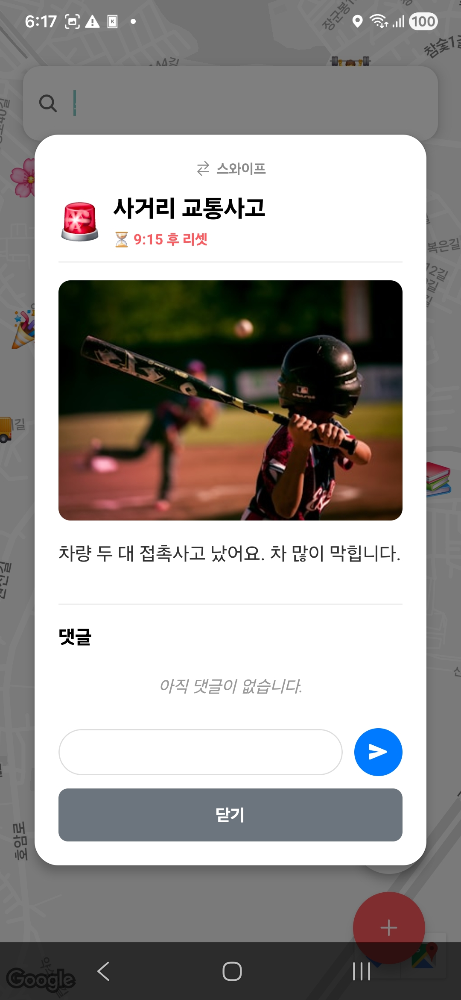
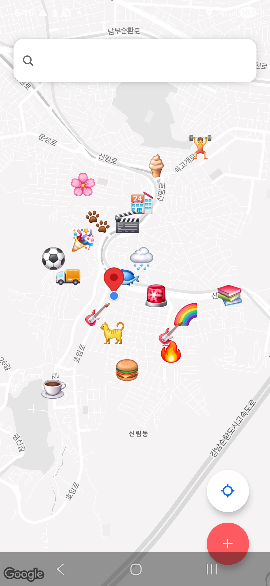
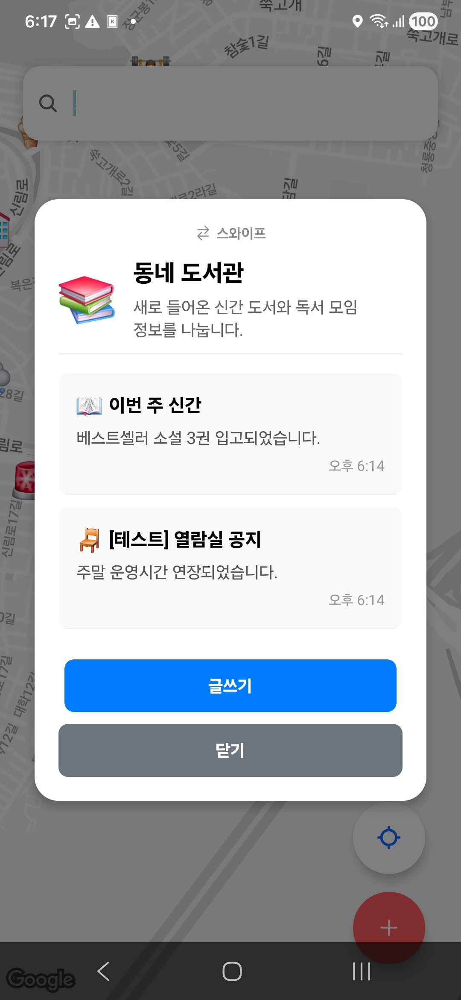

# DROP

지도 기반 실시간 위치/게시물 공유 데모 앱입니다.  
`React Native (Expo) + react-native-maps` 조합으로 구현했습니다.

## 프로젝트 개요

- 지도에서 현재 위치를 확인하고, 마커(게시물/스테이션)를 생성할 수 있습니다.
- 게시물 상세 보기, 댓글, 스테이션 하위 게시글(보드 글) 기능을 제공합니다.

## 코드 구조 간단 설명

- `App.js`
	- 앱 진입점입니다. `MapScreen` 하나를 렌더링합니다.

- `src/screens/MapScreen.js`
	- 앱의 핵심 화면입니다.
	- 지도 렌더링, 위치 권한/추적, 게시물 상태 관리, 모달 제어를 담당합니다.

- `src/components/CustomMarker.js`
	- 게시물 타입에 맞는 커스텀 마커 UI를 렌더링합니다.

- `src/components/modals/CreatePostModal.js`
	- 지도에 점(게시물/스테이션) 생성 시 입력 폼 모달입니다.

- `src/components/modals/ViewPostModal.js`
	- 게시물 상세/댓글/보드 글 조회 모달입니다.

- `src/components/modals/AddBoardPostModal.js`
	- 스테이션 내부에 보드 글을 추가하는 모달입니다.

- `src/utils/constants.js`
	- 지도 초기 좌표(`INITIAL_REGION`) 등 공통 상수를 관리합니다.

## 로컬 실행

### 1) 앱 실행(Expo)

```bash
npm install
npx expo start
```

### 2) Android 배포 APK 빌드

```bash
cd android
.\gradlew assembleRelease
```

- 빌드 결과물(원본): `android/app/build/outputs/apk/release/app-release.apk`

## 첨부 파일


### 스크린샷

<p align="center">
	
	
	
</p>


