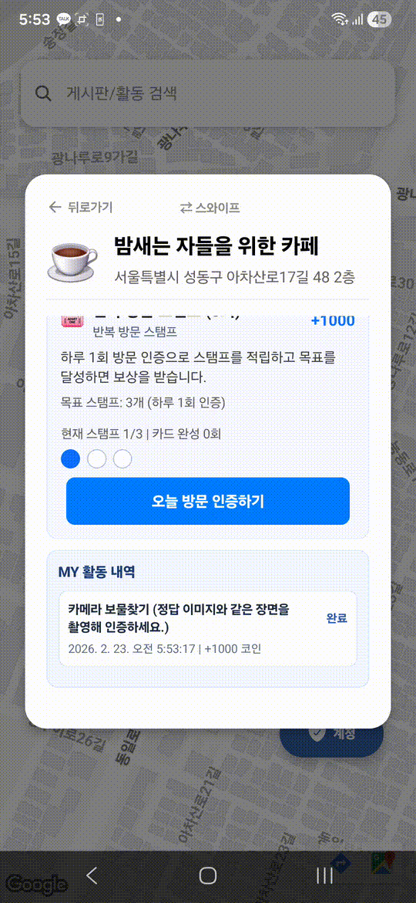
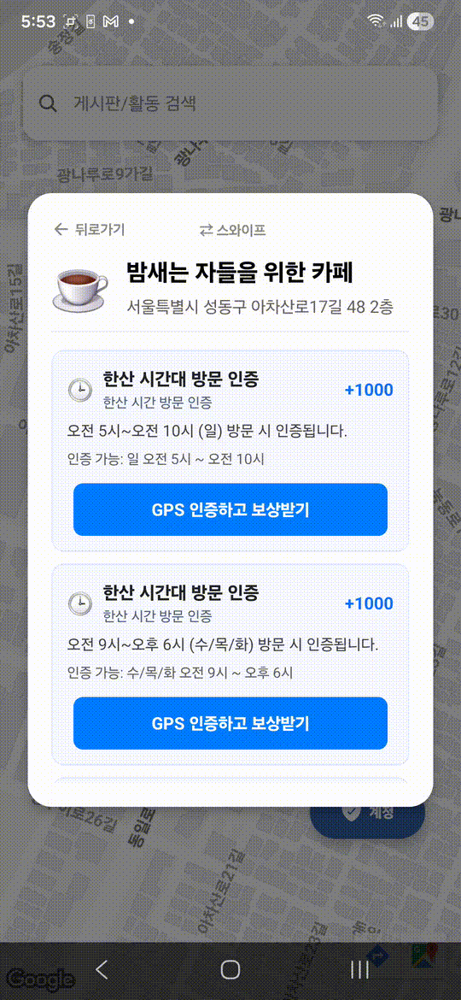
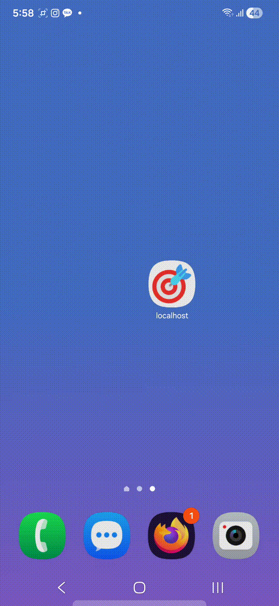
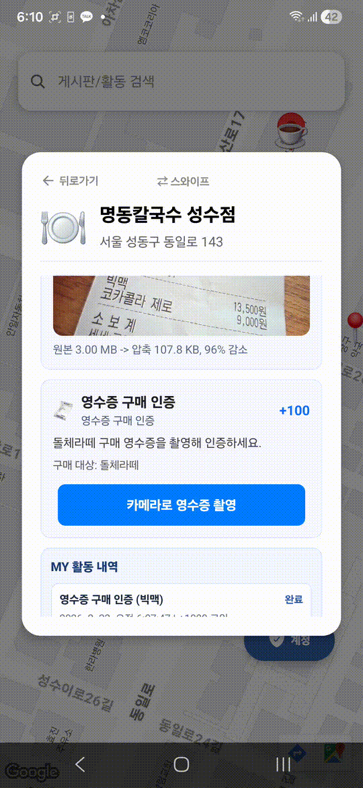

## 2026 제3회 와커톤 금상 수상작 🥇🏆

팀명: **상금수거반** 💰🧹💰🧹

- 📣 와커톤 3회 설명글: https://www.instagram.com/p/DTl7DdpAUro/
- 🖥️ 서버 레포: https://github.com/yeonseo432/localhost-server
- 🛠️ 관리자 클라이언트 레포: https://github.com/user983740/localhost_PC

<p align="center">
  
  
</p>

이 프로젝트는 **2026 제3회 와커톤 금상** 수상작입니다. 

# localhost

<p align="center">
  
</p>

위치 기반 미션을 수행하고 보상을 획득하는 O2O 리워드 앱의 프런트엔드입니다.  
사용자는 지도에서 매장을 탐색하고, 매장별 미션(영수증 인증, 보물찾기, 체류 인증, 반복 방문)을 수행해 코인을 얻습니다.

## Live Demo

<p align="center">
  <a href="https://youtu.be/Wtlmh8JPEJo">
    
  </a>
</p>

- YouTube: https://www.youtube.com/watch?v=Wtlmh8JPEJo

## 프로젝트가 해결하는 문제

일반 체크인형 서비스는 실제 행동 검증이 약합니다.  
이 프로젝트는 위치 + 이미지 검증을 결합해 오프라인 행동을 더 정확하게 인증하는 것을 목표로 합니다.

- 위치 기반 조건: 미션 지점 근접 여부 확인
- 미션별 검증: 텍스트 기반(영수증), 이미지 기반(보물찾기), 시간 기반(체류/한산시간), 반복 방문 기반(스탬프)
- 보상 지급: 성공한 미션에 대해 코인 적립

## 핵심 사용자 경험 (GIF)

### 1) 지도 탐색과 매장 전환

<p align="center">
  
  
  
</p>

- 지도에서 매장 마커를 선택하면 해당 매장 카드가 열립니다.
- 카드 좌우 스와이프 시 다음 매장으로 이동하며, 지도 중심도 해당 매장으로 애니메이션 이동합니다.
- 매장 카드 내부에서 미션 목록을 세로 스크롤로 탐색합니다.

기술 포인트:
- `react-native-maps` + `MapView.animateToRegion`으로 카드/지도 동기화
- `FlatList` `pagingEnabled` + `onViewableItemsChanged`로 좌우 스와이프 UX 구현
- 검색창에서 매장/미션 텍스트를 함께 필터링

### 2) 로그인과 토큰 캐싱

<p align="center">
  
</p>

- 로그인/회원가입 후 토큰을 로컬에 저장해 앱 재실행 시 인증 상태를 유지합니다.
- 계정 모달에서 현재 로그인 사용자와 역할(USER)을 확인하고 로그아웃할 수 있습니다.

기술 포인트:
- `zustand` + `persist(createJSONStorage(() => AsyncStorage))`
- 인증 API: `/api/auth/login`, `/api/auth/signup`
- USER 역할 계정만 앱 로그인 허용

### 3) 영수증 구매 인증 (성공/실패)

<p align="center">
  
  
</p>

- 사용자가 카메라로 영수증을 촬영하면 서버에 인증 요청을 보냅니다.
- 구매 대상 품목이 맞으면 성공하고 코인이 지급됩니다.
- 조건 불일치 또는 신뢰도 부족이면 실패/재시도 안내를 받습니다.

기술 포인트:
- `expo-image-picker` 카메라 촬영
- 업로드 전 `expo-image-manipulator`로 이미지 압축(JPEG, quality 0.45, 긴 변 최대 1920)
- `multipart/form-data`로 `/api/missions/{missionId}/attempts` 요청
- 응답 상태 `SUCCESS | FAILED | RETRY` 처리 및 `retryHint` 메시지 노출

### 4) 카메라 보물찾기 (성공/실패)

<p align="center">
  
  
</p>

- 가이드 이미지/문구를 참고해 동일한 대상을 촬영하면 인증됩니다.
- 유사도가 낮거나 다른 대상을 촬영하면 실패 처리됩니다.

기술 포인트:
- 영수증 인증과 동일한 촬영/압축/업로드 파이프라인 재사용
- 미션 타입에 따라 안내 문구와 성공/실패 메시지를 분기

### 5) 시간/체류/반복 방문 미션

각 매장에서 위아래 스크롤링으로 확인할 수 있는 미션 유형입니다.

- 한산 시간 방문 인증 (`quiet_time_visit`)
- 체류 시작/종료 인증 (`stay_duration`)
- 반복 방문 스탬프 (`repeat_visit_stamp`)

기술 포인트:
- 체류 미션은 check-in/check-out API를 분리 호출
- 반복 방문은 시도 이력으로 스탬프 진행도와 완료 라운드를 계산
- 모든 미션 참여는 현재 위치와 매장 위치 간 거리 기반 검증을 수행

## 기술 아키텍처

### Frontend Stack

- React Native 0.81 + Expo 54
- TypeScript
- Zustand (인증/지도/미션 상태)
- react-native-maps, expo-location
- expo-image-picker, expo-image-manipulator, expo-file-system

### 상태/도메인 모델

- `useAuthStore`: 로그인, 회원가입, 토큰 영속화
- `useMapStore`: 보드/미션 로드, 미션 인증, 활동 이력, 스탬프 진행도
- 백엔드 미션 타입 매핑:
  - `TIME_WINDOW` -> `quiet_time_visit`
  - `DWELL` -> `stay_duration`
  - `RECEIPT` -> `receipt_purchase`
  - `INVENTORY` -> `camera_treasure_hunt`
  - `STAMP` -> `repeat_visit_stamp`

### API 연동 포인트

- 매장/미션 조회
  - `GET /api/stores`
  - `GET /api/stores/{storeId}/missions`
- 미션 인증
  - `POST /api/missions/{missionId}/attempts`
  - `POST /api/missions/{missionId}/attempts/checkin`
  - `POST /api/missions/{missionId}/attempts/checkout`
  - `GET /api/missions/{missionId}/attempts/me`
- 인증
  - `POST /api/auth/login`
  - `POST /api/auth/signup`

## 실행 방법 (Frontend)

```bash
npm install

npm run start
npm run android
```

배포용 APK: 

```bash
cd android
.\gradlew assembleRelease
```

